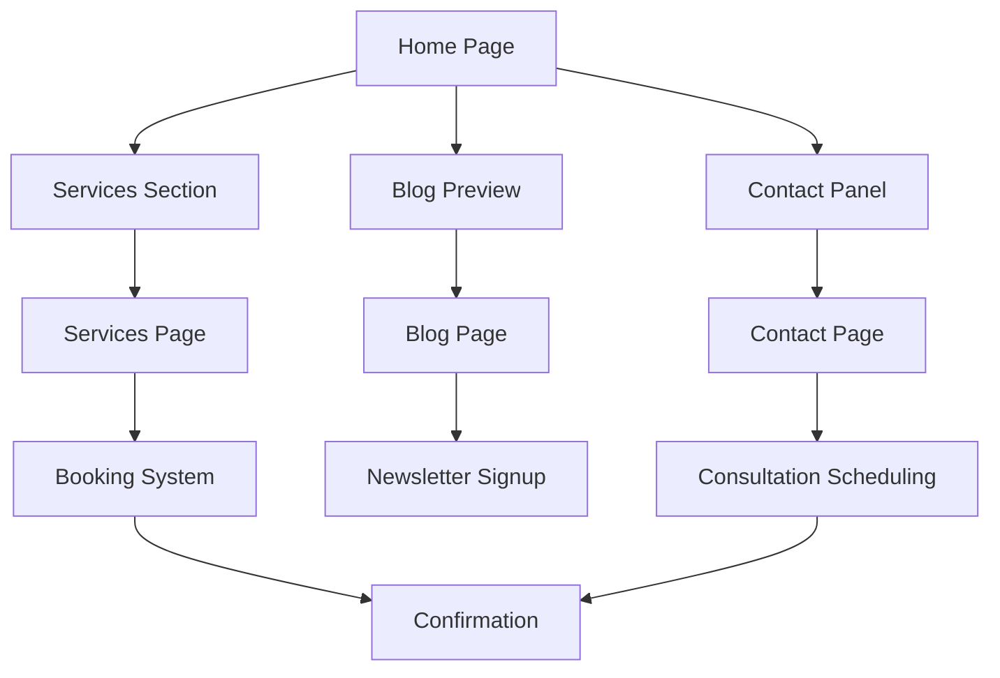

## 1. Product Overview
A professional landing page for Certified Financial Planner Aditya Very Cleverina that showcases financial expertise through modern web design. The platform helps potential clients understand financial services, access resources, and connect with the planner through multiple channels.

Target market: Individuals and businesses seeking professional financial planning services, wealth management, and financial consultation.

## 2. Core Features

### 2.1 User Roles
| Role | Registration Method | Core Permissions |
|------|---------------------|------------------|
| Visitor | No registration required | Browse all content, download templates, contact planner |
| Newsletter Subscriber | Email signup | Receive blog updates, financial tips, exclusive content |

### 2.2 Feature Module
The landing page consists of the following main pages:
1. **Home page**: Hero section with professional headshot, services overview, contact panel, blog preview.
2. **Services page**: Detailed service descriptions, pricing information, booking functionality.
3. **Blog page**: Article listings, category filtering, search functionality, newsletter signup.
4. **Contact page**: Multi-channel contact form, scheduling integration, location information.

### 2.3 Page Details
| Page Name | Module Name | Feature description |
|-----------|-------------|---------------------|
| Home page | Hero section | Display professional headshot with headline "Financial consult that leads you to your goals", subheading highlighting credentials, prominent CTA button for consultation booking. |
| Home page | Services grid | Card-based layout showing three core services: Financial Consultation, Financial Tracker Templates, Comprehensive Planning with interactive hover effects and modal details. |
| Home page | Contact panel | Multi-channel contact including phone link, email form with validation, office address, and integrated scheduling system. |
| Home page | Blog preview | Latest 3 blog posts with category tags, read more links, and newsletter signup form. |
| Services page | Service details | Detailed descriptions of each service with pricing, benefits, and booking CTA buttons. |
| Services page | Booking system | Calendar integration for scheduling consultations with availability checking and confirmation. |
| Blog page | Article listings | Grid layout of blog posts with featured images, excerpts, author info, and publication dates. |
| Blog page | Search & filter | Real-time search functionality and category filtering for easy content discovery. |
| Blog page | Newsletter signup | Email capture form with Mailchimp integration for subscriber management. |
| Contact page | Contact form | Multi-field form with name, email, phone, subject, and message fields with validation. |
| Contact page | Office information | Physical address display with map integration and business hours. |
| Contact page | Social links | Professional social media profile links with consistent branding. |

## 3. Core Process
**Visitor Flow**: Landing page → Browse services → Read blog content → Contact/book consultation → Receive confirmation

**Subscriber Flow**: Newsletter signup → Receive welcome email → Get regular updates → Engage with content → Convert to client

## 4. User Interface Design

### 4.1 Design Style
- **Primary Color**: #2C3E50 (Deep navy blue)
- **Secondary Color**: #3498DB (Bright blue)
- **Accent Color**: #B6E33D (Lime green for CTAs and highlights)
- **Typography**: Modern geometric sans-serif for headlines, clean sans-serif for body text
- **Button Style**: Pill-shaped with rounded corners, black background with white text for primary CTAs
- **Layout**: Card-based design with rounded corners, subtle geometric background shapes
- **Icons**: Minimalist line icons with consistent stroke weight

### 4.2 Page Design Overview
| Page Name | Module Name | UI Elements |
|-----------|-------------|-------------|
| Home page | Hero section | Left-aligned headline with lime green underline, professional headshot on right with floating stat badges, curved arrow pointing to CTA button. |
| Home page | Services grid | Three-column responsive grid, white cards with subtle shadows, service icons, hover animations, modal trigger buttons. |
| Home page | Contact panel | Horizontal layout with phone icon/link, email form inline, address with map pin icon, social media icons row. |
| Services page | Service cards | Expanded card layout with detailed descriptions, pricing badges, feature lists, prominent booking buttons. |
| Blog page | Article grid | Masonry-style grid with featured images, category tags, read time indicators, pagination controls. |
| Contact page | Form layout | Two-column layout with form on left, office information on right, embedded map, business hours display. |

### 4.3 Responsiveness
Desktop-first design approach with responsive breakpoints:
- Mobile: 320px - 767px (single column layout, hamburger menu)
- Tablet: 768px - 1199px (two-column layout, adjusted typography)
- Desktop: 1200px+ (full multi-column layout with all features)

Touch interaction optimization for mobile devices with larger tap targets and swipe gestures for carousels.

### 4.4 Performance & Technical Requirements
- Load time target: <2 seconds
- Total page weight: <500KB
- Lighthouse score: 90+
- Semantic HTML5 structure with proper heading hierarchy
- WCAG 2.1 AA accessibility compliance
- SEO optimization with meta tags, schema.org markup, and proper alt text