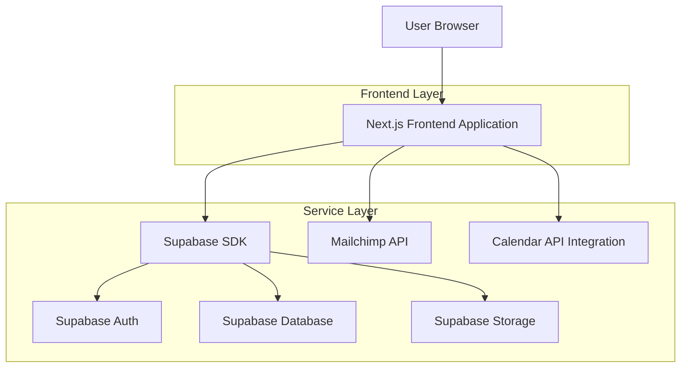
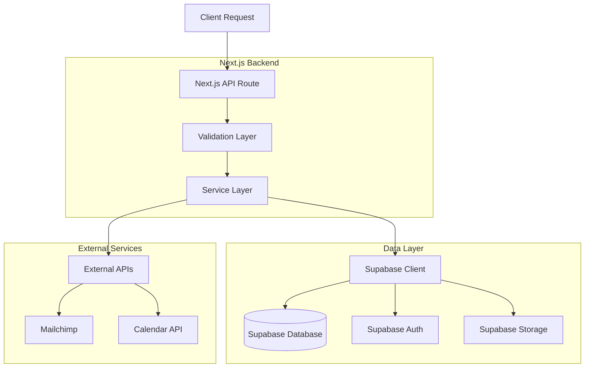
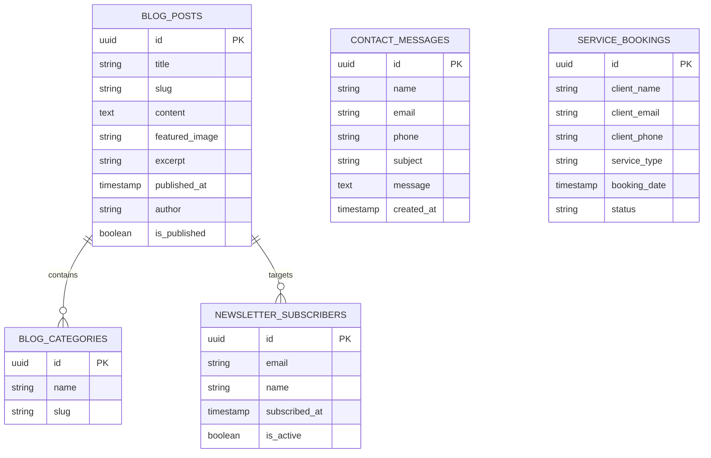

## 1. Architecture Design



## 2. Technology Description

* **Frontend**: Next.js 14 + React 18 + TypeScript

* **Styling**: Tailwind CSS 3 + CSS Modules for component-specific styles

* **Initialization Tool**: create-next-app

* **Backend**: Supabase (Authentication, Database, Storage)

* **Email Service**: Mailchimp API integration

* **Calendar Integration**: External calendar API for booking system

* **Animation Library**: Framer Motion for subtle interactions

* **Form Validation**: React Hook Form + Zod

## 3. Route Definitions

| Route           | Purpose                                                           |
| --------------- | ----------------------------------------------------------------- |
| /               | Home page with hero section, services overview, and contact panel |
| /services       | Detailed services page with pricing and booking functionality     |
| /blog           | Blog listing page with search and category filtering              |
| /blog/\[slug]   | Individual blog post page with related articles                   |
| /contact        | Contact page with form and office information                     |
| /api/newsletter | Newsletter signup API endpoint                                    |
| /api/contact    | Contact form submission API endpoint                              |

## 4. API Definitions

### 4.1 Newsletter Subscription API

```
POST /api/newsletter
```

Request:

| Param Name | Param Type | isRequired | Description              |
| ---------- | ---------- | ---------- | ------------------------ |
| email      | string     | true       | Subscriber email address |
| name       | string     | false      | Subscriber name          |
| source     | string     | false      | Signup source page       |

Response:

| Param Name | Param Type | Description         |
| ---------- | ---------- | ------------------- |
| success    | boolean    | Subscription status |
| message    | string     | Response message    |

Example:

```json
{
  "email": "client@example.com",
  "name": "John Doe",
  "source": "blog-page"
}
```

### 4.2 Contact Form API

```
POST /api/contact
```

Request:

| Param Name | Param Type | isRequired | Description     |
| ---------- | ---------- | ---------- | --------------- |
| name       | string     | true       | Contact name    |
| email      | string     | true       | Contact email   |
| phone      | string     | false      | Contact phone   |
| subject    | string     | true       | Message subject |
| message    | string     | true       | Message content |

Response:

| Param Name | Param Type | Description               |
| ---------- | ---------- | ------------------------- |
| success    | boolean    | Submission status         |
| messageId  | string     | Unique message identifier |

## 5. Server Architecture Diagram



## 6. Data Model

### 6.1 Data Model Definition



### 6.2 Data Definition Language

**Contact Messages Table**

```sql
-- Create table
CREATE TABLE contact_messages (
    id UUID PRIMARY KEY DEFAULT gen_random_uuid(),
    name VARCHAR(255) NOT NULL,
    email VARCHAR(255) NOT NULL,
    phone VARCHAR(50),
    subject VARCHAR(255) NOT NULL,
    message TEXT NOT NULL,
    created_at TIMESTAMP WITH TIME ZONE DEFAULT NOW()
);

-- Create index
CREATE INDEX idx_contact_messages_email ON contact_messages(email);
CREATE INDEX idx_contact_messages_created_at ON contact_messages(created_at DESC);

-- Grant permissions
GRANT SELECT ON contact_messages TO anon;
GRANT INSERT ON contact_messages TO anon;
```

**Blog Posts Table**

```sql
-- Create table
CREATE TABLE blog_posts (
    id UUID PRIMARY KEY DEFAULT gen_random_uuid(),
    title VARCHAR(255) NOT NULL,
    slug VARCHAR(255) UNIQUE NOT NULL,
    content TEXT NOT NULL,
    featured_image VARCHAR(500),
    excerpt TEXT,
    published_at TIMESTAMP WITH TIME ZONE,
    author VARCHAR(255),
    is_published BOOLEAN DEFAULT false,
    created_at TIMESTAMP WITH TIME ZONE DEFAULT NOW(),
    updated_at TIMESTAMP WITH TIME ZONE DEFAULT NOW()
);

-- Create index
CREATE INDEX idx_blog_posts_slug ON blog_posts(slug);
CREATE INDEX idx_blog_posts_published ON blog_posts(is_published, published_at DESC);

-- Grant permissions
GRANT SELECT ON blog_posts TO anon;
GRANT ALL PRIVILEGES ON blog_posts TO authenticated;
```

**Newsletter Subscribers Table**

```sql
-- Create table
CREATE TABLE newsletter_subscribers (
    id UUID PRIMARY KEY DEFAULT gen_random_uuid(),
    email VARCHAR(255) UNIQUE NOT NULL,
    name VARCHAR(255),
    subscribed_at TIMESTAMP WITH TIME ZONE DEFAULT NOW(),
    is_active BOOLEAN DEFAULT true
);

-- Create index
CREATE INDEX idx_newsletter_subscribers_email ON newsletter_subscribers(email);
CREATE INDEX idx_newsletter_subscribers_active ON newsletter_subscribers(is_active);

-- Grant permissions
GRANT SELECT ON newsletter_subscribers TO anon;
GRANT INSERT ON newsletter_subscribers TO anon;
```

**Service Bookings Table**

```sql
-- Create table
CREATE TABLE service_bookings (
    id UUID PRIMARY KEY DEFAULT gen_random_uuid(),
    client_name VARCHAR(255) NOT NULL,
    client_email VARCHAR(255) NOT NULL,
    client_phone VARCHAR(50),
    service_type VARCHAR(100) NOT NULL,
    booking_date TIMESTAMP WITH TIME ZONE NOT NULL,
    status VARCHAR(50) DEFAULT 'pending',
    created_at TIMESTAMP WITH TIME ZONE DEFAULT NOW()
);

-- Create index
CREATE INDEX idx_service_bookings_email ON service_bookings(client_email);
CREATE INDEX idx_service_bookings_date ON service_bookings(booking_date);

-- Grant permissions
GRANT SELECT ON service_bookings TO anon;
GRANT INSERT ON service_bookings TO anon;
```

## 7. Performance Optimization

* **Image Optimization**: Next.js Image component with automatic WebP conversion

* **Code Splitting**: Dynamic imports for heavy components

* **Caching Strategy**: Static generation for blog posts, ISR for frequently updated content

* **Bundle Size**: Tree shaking enabled, minimal third-party dependencies

* **CDN**: Supabase storage CDN for media assets

* **Lazy Loading**: Images and non-critical components loaded on demand

